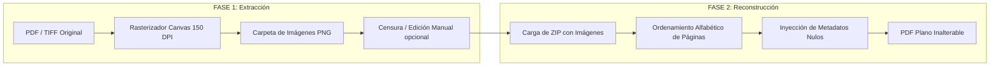

# PDF Freeze - Suite Local de Documentos

**PDF Freeze** es una suite web client-side para sanitizar, unir, ordenar, editar y comprimir documentos **PDF** (y TIFF en el flujo de sanitización), con privacidad absoluta: los archivos nunca salen del navegador.

---

## Herramientas incluidas

| Herramienta | Qué hace |
|---|---|
| **Sanitizar** | Rasteriza PDF/TIFF a PNG (150 DPI) y reconstruye un PDF plano sin capas ni metadatos |
| **Unir PDFs** | Combina varios PDFs en uno, con reordenamiento por arrastre |
| **Ordenar** | Reordena, rota y elimina páginas con miniaturas locales |
| **Editar** | Agrega texto, imágenes/logos y recuadros de color (overlays) sobre el PDF |
| **Comprimir** | Reduce peso rasterizando a JPEG con perfiles de calidad |

---

## Propósito Principal (Sanitizar)

En el ámbito profesional y legal, a menudo existe la necesidad de compartir documentos sensibles que han sido previamente editados, censurados (tachando datos personales, montos o firmas) o recortados.

### El Problema de los Editores Tradicionales
Los visores y editores de PDF tradicionales (Adobe Acrobat, Preview, etc.) guardan las ediciones en **capas superpuestas** o retienen el mapa de texto vectorial debajo del parche negro. Si simplemente dibujas un rectángulo negro sobre un texto confidencial:
- Un usuario avanzado puede seleccionar y copiar el texto oculto debajo del cuadro.
- Se pueden remover las capas o inspeccionar el código fuente del PDF.
- Se conservan metadatos sensibles (autor, fecha de creación, historial de modificación, software utilizado, firmas digitales).

### La Solución PDF Freeze
**PDF Freeze** soluciona este problema **"cocinando" (rasterizando)** el documento por completo:
1. Desarma los archivos PDF/TIFF convirtiéndolos en **imágenes puras (PNG de alta calidad)**.
2. Destruye definitivamente todas las capas de texto, objetos vectoriales, formularios, metadatos ocultos y contraseñas.
3. Permite al usuario editar o tachar las imágenes resultantes.
4. Reconstruye el documento final ensamblando las imágenes en un **PDF plano como un bloque sólido**.

El resultado final es un archivo **completamente inalterable, irreversible y a prueba de ingeniería inversa**.

---

## ¿Cómo Funciona? (Sanitización en 2 Fases)

### 1. FASE 1: Extracción y Aplanado (De Documento a Imágenes)
- **Formatos soportados:** Detecta y procesa automáticamente archivos `.pdf`, `.tif` y `.tiff`.
- **Rasterización:** Renderiza cada página del documento original a una imagen PNG de alta fidelidad (**150 DPI**).
- **Destrucción de Capas:** Al convertir cada página en una imagen bitmap plana, se eliminan definitivamente:
  - Capas de texto seleccionable y texto invisible OCR.
  - Vectores, marcas de agua internas y firmas digitales.
  - Metadatos del documento y contraseñas de restricción de lectura/impresión.
- **Resultado:** Genera un archivo comprimido `.zip` con la estructura de carpetas de origen y las imágenes nombradas de forma secuencial (`pag_001.png`, `pag_002.png`, etc.). Aquí el usuario puede tachar o editar las imágenes libremente en cualquier programa básico (Paint, Photoshop, GIMP) sin dejar rastro alguno.

### 2. FASE 2: Reconstrucción (De Imágenes a Bloque Sólido)
- **Carga de Archivo:** El usuario sube el archivo `.zip` resultante (con las imágenes editadas o sin editar).
- **Ordenamiento Estricto:** Reordena alfabética y numéricamente las páginas para asegurar la secuencia exacta.
- **Ensamble Plano:** Crea un nuevo lienzo PDF e inserta cada imagen respetando sus dimensiones originales.
- **Sanitización de Metadatos:** Aplica una directiva de metadatos nulos en el encabezado del nuevo PDF (`setTitle('')`, `setAuthor('')`), garantizando que no contenga historial, autor ni software emisor.
- **Resultado:** Un nuevo archivo PDF comprimido en formato `.zip`, sólido y seguro para ser enviado a cualquier destinatario.

---

## Herramientas adicionales

### Unir PDFs
Carga múltiples archivos, reordénalos (arrastre o botones) y descarga un único PDF. Se limpian metadatos del documento resultante.

### Ordenar
Abre un PDF, genera miniaturas locales y permite:
- Reordenar por arrastre
- Rotar 90° (izquierda/derecha)
- Eliminar páginas
- Exportar el PDF resultante

### Editar
Editor de capas encima del PDF (no reedita el texto nativo del documento):
- Agregar texto (doble clic para editar)
- Agregar imagen / logo
- Agregar recuadro de color (útil para tapar datos visualmente)
- Mover, redimensionar y eliminar solo los elementos nuevos
- Exportar fusionando las anotaciones en el PDF

> Para ocultar datos de forma irreversible, use **Sanitizar** (rasterización) después de editar, o un recuadro opaco + Freeze.

### Comprimir
Rasteriza cada página a JPEG según el perfil elegido:
- **Alta calidad:** 120 DPI · JPEG 85%
- **Equilibrada:** 96 DPI · JPEG 70%
- **Máxima reducción:** 72 DPI · JPEG 55%

> La compresión convierte el contenido a imagen: el texto deja de ser seleccionable. Es el trade-off habitual para bajar peso de forma predecible en el navegador.

---

## Replicación Recursiva de Carpetas (Efecto Espejo)

En el flujo de **Sanitizar**, PDF Freeze está optimizado para el **procesamiento masivo** y el respeto de la estructura jerárquica de archivos del usuario:

- **Lectura Recursiva:** Si seleccionas una carpeta principal con múltiples subcarpetas anidadas (ej. `Clientes/2026/Facturas/contrato.pdf`), la herramienta escaneará automáticamente todas las ramificaciones sin importar el nivel de profundidad.
- **Efecto Espejo:** Al extraer las imágenes (Fase 1) o reconstruir los PDFs (Fase 2), la aplicación genera exactamente la misma estructura de carpetas de origen.

---

## Privacidad y Seguridad Total (100% Browser-Side)

> [!IMPORTANT]
> **Tus archivos NUNCA salen de tu computadora.**

A diferencia de otros conversores online, PDF Freeze ejecuta todo el proceso de renderizado, conversión de archivos, compresión ZIP y generación de PDF **directamente en la memoria de tu navegador web** mediante JavaScript. No utiliza ningún servidor backend para procesar los datos.

- **Sin subida a la nube:** Cero almacenamiento o transferencia a servidores externos.
- **Funciona Offline:** Una vez cargada la página, puedes desconectarte de Internet y la aplicación seguirá funcionando al 100%.
- **Cumplimiento estricto de privacidad:** Ideal para datos sensibles de salud, finanzas, documentos legales o corporativos confidenciales.

---

## Tecnologías Utilizadas

La aplicación está construida como un sitio web estático ultra liviano usando tecnologías web estándar y librerías cliente de primer nivel:

- **HTML5 & CSS3 Vanilla:** Interfaz en modo oscuro moderna, limpia, responsiva y orientada a la experiencia de usuario.
- **[PDF.js](https://mozilla.github.io/pdf.js/) (Mozilla):** Motor de renderizado en Canvas para convertir archivos PDF a imágenes en el navegador.
- **[pdf-lib](https://pdf-lib.js.org/):** Librería cliente para unir, rotar, copiar páginas e instanciar PDFs limpios.
- **[JSZip](https://stuk.github.io/jszip/):** Gestión y generación de archivos comprimidos preservando la jerarquía de directorios.
- **[UTIF.js](https://github.com/photopea/UTIF.js):** Decodificador multipágina para archivos TIFF.
- **[FileSaver.js](https://github.com/eligrey/FileSaver.js/):** Manejo de descargas en el cliente.

---

## Guía de Despliegue en Netlify

Dado que **PDF Freeze** es una aplicación 100% estática (HTML/CSS/JS), su despliegue en **Netlify** es instantáneo y gratuito.

### Opción 1: Netlify Drop (La opción más rápida - Sin línea de comandos)
1. Inicia sesión en tu cuenta de [Netlify](https://app.netlify.com/).
2. Dirígete a la pestaña **Sites** y haz clic en la sección [Netlify Drop](https://app.netlify.com/drop).
3. Arrastra la carpeta completa del proyecto (`pdf-freeze`) y suéltala en la zona delimitada.
4. En cuestión de segundos, Netlify desplegará tu sitio con un dominio gratuito HTTPS.

### Opción 2: Vinculando a GitHub (Despliegue Continuo)
1. Sube este proyecto a un repositorio de GitHub.
2. En tu panel de Netlify, haz clic en **"Add new site"** > **"Import an existing project"**.
3. Selecciona **GitHub** y escoge el repositorio `pdf-freeze`.
4. Configura los parámetros de compilación:
   - **Build command:** *(Dejar en blanco)*
   - **Publish directory:** `.` *(un punto, o dejar la raíz)*
5. Haz clic en **"Deploy site"**.

---

## Ejecución en Entorno Local

1. Clona o descarga este repositorio.
2. Abre la carpeta del proyecto.
3. Haz doble clic en el archivo `index.html` para abrirlo en tu navegador.

---

## Licencia y Créditos

Este proyecto está distribuido bajo la licencia **MIT**. Desarrollado por [Liao Miguel](https://liao.com.ar).
